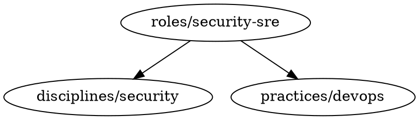

<!-- Generated by Cartulari — do not edit manually -->
<!-- Source: https://github.com/miegjorn/Fondament -->

> **Foundation layer — base types and shared interfaces**

---

# Fondament — Agent Infrastructure

**Fondament** (Occitan: *foundation*) is the single source of truth for all agent primitives in the Occitan stack. It owns all discipline, practice, role, stance, and tool definitions as YAML files and serves as the registry consumed by every other service in the stack.

> **Fondament defines the shape. Farga provides the clothes.**

An agent is a dynamically assembled context. Fondament defines the static primitives (disciplines, practices, roles, stances, tools). Farga holds the living content (org layer, initiative layer, project layer) that dresses those primitives into a fully resolved agent at dispatch time.

---

## Table of Contents

1. [Repository Layout](#repository-layout)
2. [Architecture Overview](#architecture-overview)
3. [Definition File Schema](#definition-file-schema)
4. [Definition Kinds](#definition-kinds)
5. [CompositionAddress](#compositionaddress)
6. [Resolver and Layer Order](#resolver-and-layer-order)
7. [DefinitionTree](#definitiontree)
8. [Hot-Reload Watcher](#hot-reload-watcher)
9. [FargaReader Trait](#fargareader-trait)
10. [Lint System](#lint-system)
11. [CLI Commands](#cli-commands)
12. [Consuming Fondament: Amassada and Charradissa](#consuming-fondament-amassada-and-charradissa)
13. [Error Types](#error-types)
14. [Testing](#testing)
15. [Key Dependencies](#key-dependencies)
16. [Out of Scope (v1)](#out-of-scope-v1)

---

## Repository Layout

```
fondament/
├── Cargo.toml                  # workspace root
├── fondament-core/             # resolver library — consumed by Amassada and Charradissa
│   ├── src/
│   │   ├── address.rs          # CompositionAddress enum + parser
│   │   ├── definition.rs       # DefinitionFile struct
│   │   ├── error.rs            # FondamentError + Result alias
│   │   ├── farga.rs            # FargaReader trait + context types
│   │   ├── farga_http.rs       # HttpFargaReader — live Farga context over HTTP
│   │   ├── fondament.rs        # Fondament + WatchedFondament entry points
│   │   ├── lint/
│   │   │   ├── mod.rs
│   │   │   ├── fast.rs         # structural lint (no LLM)
│   │   │   └── sweep.rs        # semantic sweep stub (LLM-assisted, scheduled)
│   │   ├── resolver.rs         # layer assembly logic
│   │   ├── tools.rs            # ToolDefinition, ToolSet, ToolRegistry
│   │   ├── tree.rs             # DefinitionTree — load, get, reload_file
│   │   ├── types.rs            # ModelId, ResolvedAgent, LayerKind
│   │   └── watcher.rs          # notify-based file watcher
│   └── tests/
│       ├── address_tests.rs
│       ├── lint_tests.rs
│       ├── resolver_tests.rs
│       └── tree_tests.rs
├── fondament-cli/              # validate, lint, scaffold, graph, sweep
│   └── src/
│       ├── main.rs
│       └── commands/
│           ├── check.rs        # fondament check
│           ├── resolve.rs      # fondament resolve
│           ├── scaffold.rs     # fondament scaffold
│           ├── graph.rs        # fondament graph
│           └── sweep.rs        # fondament sweep
├── definitions/                # the primitive tree
│   ├── disciplines/            # atomic horizontal knowledge domains
│   │   ├── deconstructive.yaml # modifier discipline — no context, injects preamble behaviour
│   │   ├── rust-async.yaml
│   │   └── data/
│   │       └── db/
│   │           └── mysql.yaml
│   ├── roles/                  # named compositions: discipline/practice + stance + cognitive_load
│   │   └── security-sre.yaml
│   ├── stances/                # cognitive postures
│   │   └── adversarial.yaml
│   ├── tools/                  # tool connection specs
│   ├── domains/                # kind: domain — component/system identity context
│   └── fondament/              # pre-built agent roster (developer, guilhem, app-architect, ...)
│       ├── domains/            # kind: project-agent — template definitions for per-project agents
│       │   └── project-agent.yaml
│       └── projects/           # kind: project-composition — concrete instantiated project agents
│           └── example-agent.yaml
└── packages/                   # Cor plugin packages (installable via `cor install`)
    └── deconstructive/
        ├── plugin.toml         # Cor manifest (id, kind, compatibility, artifact, install)
        └── deconstructive.yaml # installable artifact
```

---

## Architecture Overview

Fondament is a Cargo workspace with two crates:

| Crate | Purpose |
|---|---|
| `fondament-core` | Library crate. Parses definitions, resolves agents, runs lint, exposes the `Fondament` struct. Consumed by Amassada (dispatch daemon) and Charradissa (canvas runtime). |
| `fondament-cli` | Binary crate. Thin CLI wrapper over `fondament-core` for local developer workflows: linting, resolving, scaffolding, and graphing. |
| `fondament-server` | Binary crate. Optional REST service exposing the definition tree and resolver over HTTP. See [fondament-server](#fondament-server). |

The library's public entry point is the `Fondament` struct in `fondament.rs`:

```rust
pub struct Fondament {
    tree: Arc<RwLock<DefinitionTree>>,
    farga: Arc<dyn FargaReader>,
    org: String,
    definitions_path: PathBuf,
}
```

Calling `Fondament::load` scans the definitions directory into memory. Calling `.watch()` activates the hot-reload watcher and returns a `WatchedFondament` that holds both the struct and the `WatchHandle` keeping the background watcher alive. Calling `.resolve(address)` assembles a fully layered `ResolvedAgent` from Farga context plus Fondament definitions.

---

## Definition File Schema

Every definition file is a YAML document. All fields follow a consistent envelope:

```yaml
id: <kind-prefix>/<name>          # required — unique key in the DefinitionTree
kind: discipline | practice | role | stance
extends: [<id>, ...]              # optional — parent definitions to inherit from
default_model: claude-sonnet-4-6  # optional — overrides default (claude-sonnet-4-6)
context: |                        # optional — system-prompt fragment for this definition
  ...
tools:
  always_on:                      # attached to every resolve that includes this definition
    - id: <tool-id>
      kind: mcp | api | native
      server: <server-name>       # for mcp/api
      tool: <tool-name>           # for mcp/api
      handler: <fn-name>          # for native
  jit:                            # available on demand, not loaded by default
    - ...
skills:                           # optional — flat list of skill names (e.g. Superpowers
  - <skill-id>                    # skills like "superpowers:brainstorming"). No always_on/jit
  - ...                           # split, since skills don't carry tools' permission-gating distinction.
stance: <stance-id>               # roles only — default stance
cognitive_load: low | medium | high  # roles only — narrative hint for model selection
modifier: true                    # disciplines only — marks a modifier discipline (see below)
```

The `DefinitionFile` struct mirrors most of this schema, but **not `skills`** — that field
exists on several role YAML files (e.g. `developer.yaml`, `guilhem.yaml`) and is parsed
silently as an unknown field today (serde's default behavior, not an error). Nothing in
`fondament-core` resolves or exposes it yet:

```rust
pub struct DefinitionFile {
    pub id: String,
    pub kind: String,
    pub extends: Vec<String>,
    pub default_model: Option<ModelId>,
    pub context: Option<String>,
    pub tools: ToolSet,
    // skills: NOT a field here yet — see note above.
    pub stance: Option<String>,
    pub cognitive_load: Option<String>,
    pub modifier: bool,        // default false; true for disciplines that modify assembly behaviour
    pub component: Option<String>, // component-agent only — names the component this agent owns
    // project-composition fields — only present when kind == "project-composition"
    pub name: Option<String>,
    pub description: Option<String>,
    pub model: Option<String>, // composition model (distinct from default_model)
    pub parts: Vec<serde_yaml::Value>, // ordered list of context sources (inline, farga, ...)
}
```

Until a resolver path for `skills` exists, consumers that want a role's skill list must
read the persona YAML file directly rather than going through `Fondament::resolve()` —
this is a real, narrower gap than `tools.always_on`, which IS resolved by this crate (see
`resolver.rs`); only `allowed_tools`-style consumers (e.g. Caissa's dispatcher, which has
the calling agent read `tools.always_on` straight from the YAML to build a job's tool
allow-list) bypass the resolver the same way `skills` currently must.

`ModelId` is a newtype over `String`. Valid values are `claude-haiku-4-5-20251001`, `claude-sonnet-4-6`, `claude-opus-4-8`, and `claude-fable-5`. The fast lint rejects any other string. The default when `default_model` is absent is `claude-sonnet-4-6`.

---

## Definition Kinds

### Discipline

Atomic horizontal knowledge domains. A discipline captures deep expertise in one area and is meant to be composed into practices and roles. It may extend a parent discipline to form a hierarchy (e.g. `data/db/mysql` extends `data/db`).

```yaml
id: data/db/mysql
kind: discipline
default_model: claude-haiku-4-5-20251001
context: |
  You are an expert in MySQL. You understand schema design, query optimization,
  indexing strategies, and replication topology.
tools:
  always_on:
    - id: schema_reader
      kind: mcp
      server: mysql-mcp
      tool: read_schema
  jit:
    - id: query_optimizer
      kind: mcp
      server: mysql-mcp
      tool: optimize_query
```

The `default_model` on a discipline sets the cognitive load baseline for that domain. A fast, narrow domain (schema reads) can use Haiku; a broad reasoning domain might declare Sonnet.

### Modifier Discipline

A special class of discipline that changes **how prompt assembly behaves** rather than contributing corpus content. Modifier disciplines have `modifier: true` and no `context` field. They are referenced in composition addresses alongside a `+` qualifier and are never walked as corpus layers — the resolver detects their presence upfront and applies their behaviour as a side-effect of assembly.

The only built-in modifier discipline is `deconstructive`:

```yaml
id: disciplines/deconstructive
kind: discipline
modifier: true
```

When `deconstructive` is active the resolver:
1. Generates a preamble that lists the agent's actual composed parts (disciplines + stance by name)
2. Injects that preamble as the **first** layer of the system prompt — before org, initiative, and domain context
3. Sets `thinking_budget` on `ResolvedAgent` so the dispatch layer can enable extended thinking

The internal dialog runs inside the extended thinking block and is invisible to end users. Public output is only the collapsed answer. See [CompositionAddress](#compositionaddress) for address syntax and [Resolver and Layer Order](#resolver-and-layer-order) for injection position.

The fast lint's `non-empty-context` rule is suppressed for modifier disciplines — their empty context is intentional.

#### Why raw decomposition, not pre-synthesis

The preamble injects the agent's actual composed parts verbatim and asks
the model to debate them live — it deliberately does *not* hand the model
a pre-resolved summary of how those parts relate. This is an empirical
choice, not a stylistic one: across six experiments (Haiku 4.5, Sonnet
4.6, and Opus 4.8; nine question cases spanning architecture, ethics, and
business-tradeoff domains; one stress test with a deliberately corrupted
synthesis), raw-voice injection tied or beat pre-synthesized
crystallization in every comparison and never lost. It also held up as the
cheapest and fastest option at the Haiku tier, so the mechanism is not
gated behind an expensive model. Full methodology, results tables, and
limitations: [`docs/deconstructive-empirical-basis.md`](docs/deconstructive-empirical-basis.md).

### Practice

Vertical compositions that extend multiple disciplines. A practice captures a cross-cutting skill set built from several atomic domains.

```yaml
id: practices/devops
kind: practice
extends: [disciplines/compute, disciplines/delivery, disciplines/security]
default_model: claude-sonnet-4-6
context: |
  You specialize in DevOps — infrastructure automation, CI/CD pipelines,
  and reliability engineering across the delivery lifecycle.
tools:
  always_on: []
  jit: []
```

### Role

A named composition that wires a discipline or practice to a stance and cognitive load. Roles are the primary unit dispatched by Amassada and referenced by canvases. A role may extend multiple disciplines and/or practices.

```yaml
id: roles/security-sre
kind: role
extends: [disciplines/security, practices/devops]
stance: adversarial
cognitive_load: high
default_model: claude-opus-4-8
context: |
  You operate across security and reliability. You challenge assumptions,
  probe failure modes, and treat every system boundary as an attack surface.
tools:
  always_on: []
  jit: []
skills:
  - superpowers:systematic-debugging
  - superpowers:receiving-code-review
```

`default_model` on a role overrides the discipline baseline — higher cognitive load warrants a more capable model. `skills` (seen here, and on the `fondament/*` facet roles dispatched by Caissa — `developer`, `infra-engineer`, `qa-engineer`, `security-analyst`, `app-architect`, `data-architect`, `guilhem`) is currently role-only by convention, not by schema enforcement — nothing rejects it on a discipline, practice, or stance file, but no consumer reads it from those kinds today either.

### Stance

A cognitive posture appended last in the layer stack, after all domain expertise has been assembled. A stance shapes *how* the agent reasons, not *what* it knows.

```yaml
id: stances/adversarial
kind: stance
context: |
  Challenge every assumption. Seek failure modes. Your role is to stress-test
  proposals, not build consensus. Disagreement is contribution.
```

Built-in stances in the tree: `builder`, `adversarial`, `moderator`, `realist`, `dreamer`.

### Domain

Describes what a component or system *is* — its identity, principles, and place in the stack. Domain definitions are context entries for Caissa, not documentation of current state (that lives in Farga). They carry a `repo:` field naming the owning repository and optionally a `default_facet:`.

```yaml
id: domain/fondament
kind: domain
repo: Fondament
default_facet: architect
context: |
  Fondament is the agent identity library of the Occitan stack. ...
```

### Component-Agent

A named agent tied to a specific component (service, library, or subsystem). Component-agents carry a `component:` field that identifies which system they own. They are authoritative voices for their component — the agent to dispatch when work concerns that component specifically.

```yaml
id: fondament/farga-agent
kind: component-agent
component: farga
default_model: claude-sonnet-4-6
context: |
  You are the Farga component agent — the voice and authority of Farga ...
tools:
  always_on: []
  jit: []
```

Listed via `GET /component-agents` on `fondament-server`.

### Project-Agent

A template definition for project-scoped agents. Unlike component-agents (which are authoritative for a component), project-agents are instantiated per-project — each project gets its own instance carrying project-specific goals, blockers, and context fetched live from Farga. The template declares tools and operating principles; the instance fills in the project.

```yaml
id: fondament/domains/project-agent
kind: project-agent
default_model: claude-opus-4-8
context: |
  You are a project agent within the Occitan stack. ...
tools:
  always_on:
    - id: farga-read-context
      kind: mcp
      server: farga
      tool: read_context
```

### Project-Composition

A concrete instantiation of a project agent. Uses a `parts:` list to assemble context from multiple sources (`inline` for static text, `farga` to pull live project context at spawn time). The `model:` field sets the composition model and is validated separately from `default_model`. The `name:` and `description:` fields are human-readable metadata.

To enable the deconstructive modifier, add it via the `CompositionAddress` at dispatch time (e.g. `fondament/projects/example-agent+deconstructive`) — it is not controlled by a field in the definition file.

```yaml
id: fondament/projects/example-agent
kind: project-composition
name: "example-agent"
description: "Project agent for Example"
model: claude-sonnet-4-6
parts:
  - role: "development assistant"
    source: inline
    content: |
      You are the Example project agent.
  - role: context
    source: farga
    project: "example"
```

---

## CompositionAddress

A `CompositionAddress` is the typed key used to request a resolved agent. Two address forms are valid:

```
fondament/<role-id>                          # references a Fondament role directly
<project>/<facet>+<stance>                   # Farga project context + facet + stance
<project>+<stance>                           # Farga project context + stance (no facet)
```

Modifier disciplines (e.g. `deconstructive`) stack before the stance with an additional `+`:

```
fondament/<role-id>+deconstructive           # Role + modifier, no stance
fondament/<role-id>+deconstructive+<stance>  # Role + modifier + stance override
<project>/<facet>+deconstructive+<stance>    # Composed + modifier + stance
```

Examples:

| String | Variant | Meaning |
|---|---|---|
| `fondament/security-sre` | `Role` | Resolve the `roles/security-sre` definition directly |
| `fondament/app-architect+adversarial` | `Role` | As above, stance override to `adversarial` |
| `fondament/app-architect+deconstructive` | `Role` | As above, with deconstructive preamble injection and extended thinking enabled |
| `fondament/app-architect+deconstructive+adversarial` | `Role` | Modifier + stance override combined |
| `acme-auth/auth+adversarial` | `Composed` | Fetch `acme-auth` project context from Farga, narrow to `auth` facet, apply `adversarial` stance |
| `acme-auth/auth+deconstructive+adversarial` | `Composed` | As above, with deconstructive modifier |

The Rust enum:

```rust
pub enum CompositionAddress {
    Role {
        role: String,
        modifiers: Vec<String>,          // e.g. ["deconstructive"]
        stance_override: Option<String>,
    },
    Composed {
        project: String,
        facet: Option<String>,
        modifiers: Vec<String>,          // e.g. ["deconstructive"]
        stance: String,
    },
}

/// Discipline names that route to `modifiers` rather than `stance` during parsing.
pub const KNOWN_MODIFIER_DISCIPLINES: &[&str] = &["deconstructive"];
```

Parsing rules (`FromStr`):
- The string is split on all `+` characters. The first segment is the path; all subsequent segments are qualifiers.
- Qualifiers in `KNOWN_MODIFIER_DISCIPLINES` go to `modifiers`. All others go to `stance` (two non-modifier qualifiers is an error).
- Empty path or empty qualifier segments are errors.
- If the path starts with `fondament/`, or if no stance qualifier was found, the address is `Role`.
- Otherwise it is `Composed`. The path is split on `/` to yield `project` and optional `facet`.

`Display` round-trips losslessly: modifiers are emitted before the stance, matching parse order.

---

## Resolver and Layer Order

`resolver::resolve` assembles a `ResolvedAgent` by stacking context layers in this order:

```
0. Deconstructive preamble — injected first when the address carries the deconstructive modifier;
                              lists the agent's composed parts and instructs internal decomposition
                              before collapse (invisible to end users — runs in extended thinking)
1. Org layer               — Farga: culture, standing rules, org-wide constraints
2. Initiative layer        — Farga: strategic goals, active initiatives (0–N entries)
3. Project layer           — Farga: local goals, success criteria (Composed addresses only)
4. Definition layers       — Fondament: extends chain walked depth-first; each non-modifier
                              definition's context appended in resolution order; modifier
                              disciplines are skipped (they have no context)
5. Stance layer            — Fondament: stance context appended last (Role stance_override
                              or Composed stance, looked up as stances/<name> in the tree)
```

The extends chain is walked iteratively with cycle detection. If `CircularExtends` is detected, resolution fails immediately with a `FondamentError::CircularExtends` error rather than looping. The `default_model` is updated as each definition in the chain is visited — the last non-`None` value wins, so a role's `default_model` overrides its disciplines' baselines.

During resolution, the resolver collects a `parts` list of named components (non-modifier disciplines, stance) for use in the deconstructive preamble. `thinking_budget` is computed as `(parts.len() * 3000).clamp(3000, 10000)` and returned on `ResolvedAgent`; the dispatch layer (Charradissa) is responsible for passing it to the Anthropic API as `thinking.budget_tokens`.

The `ResolvedAgent` returned:

```rust
pub struct ResolvedAgent {
    pub system_prompt: String,          // all layers joined with double newline
    pub tools: Vec<ToolDefinition>,     // always_on tools from all definitions in the chain
    pub jit_tools: Vec<ToolDefinition>, // jit tools from all definitions in the chain
    pub default_model: ModelId,         // final model after chain traversal
    pub thinking_budget: Option<u32>,   // set when deconstructive modifier is active
}
```

`ResolvedAgent` has no `skills` field — a role's `skills:` YAML list (see Definition File
Schema above) is not part of resolution today. A consumer that wants a role's skills must
read the persona YAML directly, the same workaround Caissa's dispatcher already uses for
the `allowed_tools` it derives from `tools.always_on`.

---

## DefinitionTree

`DefinitionTree` is an in-memory `HashMap<String, DefinitionFile>` keyed by definition `id`. It is the core data structure shared between the resolver, the lint system, and the watcher.

```rust
pub struct DefinitionTree {
    definitions: HashMap<String, DefinitionFile>,
}
```

Key methods:

| Method | Description |
|---|---|
| `DefinitionTree::load(root: &Path)` | Recursively scans `root` for `*.yaml` files, parses each into a `DefinitionFile`, and inserts by `id`. Directories without `.yaml` files are silently skipped. |
| `tree.get(id: &str)` | Returns `Option<&DefinitionFile>`. |
| `tree.all()` | Returns an iterator over all `DefinitionFile` values. Used by the lint runner and tool registry builder. |
| `tree.reload_file(path: &Path)` | Parses a single file and upserts it into the map. Called by the watcher on every detected change. |

---

## Hot-Reload Watcher

`watcher::watch` wraps the `notify` crate to provide zero-downtime live updates. When any `.yaml` file under the definitions directory changes:

1. `tree.reload_file` is called to parse the new content.
2. If parsing succeeds, `run_fast` (the structural lint) runs immediately against the updated tree.
3. If lint passes, the change is committed to the shared `Arc<RwLock<DefinitionTree>>` and a `tracing::info` event is emitted.
4. If lint fails, a `tracing::warn` event is emitted and the previous valid tree is retained. The daemon never serves a broken definition.

`watch` returns a `WatchHandle` that owns the underlying `RecommendedWatcher`. Dropping the handle stops the watcher. In `Fondament::watch()` the handle is bundled into `WatchedFondament` to tie its lifetime to the owning struct.

---

## FargaReader Trait

Fondament does not know how Farga stores or indexes context. The boundary is an async trait:

```rust
#[async_trait]
pub trait FargaReader: Send + Sync {
    async fn org_layer(&self, org: &str) -> Result<OrgContext>;
    async fn initiative_layer(&self, org: &str) -> Result<Vec<InitiativeContext>>;
    async fn project_layer(&self, project: &str) -> Result<ProjectContext>;
    async fn component_layer(&self, project: &str, path: &str) -> Result<ProjectContext>;
}
```

Context types are simple content wrappers:

```rust
pub struct OrgContext        { pub content: String }
pub struct InitiativeContext { pub content: String }
pub struct ProjectContext    { pub content: String }
```

The concrete `FargaReader` implementation lives in the Farga repository. In tests and in the CLI's `resolve` command, a `NoopFarga` or `MockFarga` is used to exercise the resolver without a live Farga connection.

---

## Lint System

The lint system is split into two modes: **fast** (structural, synchronous, no LLM) and **sweep** (semantic, async, LLM-assisted).

### Fast Lint (`lint::fast::run_fast`)

Runs on every file-save via the watcher and on every `fondament check` invocation. It iterates all definitions in the tree and checks:

| Rule | Kind | Description |
|---|---|---|
| `valid-model-id` | Fail | `default_model` must be one of the four known Claude model strings. |
| `extends-exists` | Fail | Every ID listed in `extends` must exist in the current tree. |
| `non-empty-context` | Warn | Definitions with `kind: discipline`, `practice`, or `role` should have a non-empty `context` string. An agent with an empty context has no domain expertise. Suppressed for modifier disciplines (`modifier: true`) — their empty context is intentional. |

Each definition produces one `LintResult` variant:

```rust
pub enum LintResult {
    Pass(String),
    Fail { id: String, rule: String, message: String },
    Warn { id: String, rule: String, message: String },
}
```

Failures cause `fondament check` to exit non-zero. Warnings are printed but do not block.

### Sweep Lint (`lint::sweep`)

LLM-assisted semantic analysis intended to run on a schedule. The `lint::sweep::run_sweep` library function itself remains a stub returning an empty `SweepReport` (see below). A separate, independently implemented `fondament sweep` CLI command (`fondament-cli/src/commands/sweep.rs`) exists and is functional today — it calls the Anthropic API directly (per-definition, not via `run_sweep`/`SweepReport`) to assess whether each definition's `context` matches its declared `kind`/`id`. See [`fondament sweep`](#fondament-sweep-path) below. The two are not yet unified; the structured `SweepConflict`/`ConvergenceOpportunity` checks described next are still aspirational. The sweep checks for:

- Conflicting goals between roles at the same layer
- Strategy conflicts (two roles pursuing incompatible approaches)
- REST/API endpoint overlap across projects
- Access control drift (permissions granted at role level contradicting org-layer policy)
- Goal definition conflicts across initiatives
- Convergence opportunities (disciplines with significant overlap suggesting a shared primitive)

Output is a structured `SweepReport`:

```rust
pub struct SweepReport {
    pub conflicts: Vec<SweepConflict>,
    pub convergence: Vec<ConvergenceOpportunity>,
}

pub struct SweepConflict {
    pub id: String,
    pub severity: String,   // "high" | "low"
    pub kind: String,       // "access_control" | "goal_overlap" | ...
    pub description: String,
    pub layers: Vec<String>,
    pub resolution: String, // "requires_human" | "suggested_merge"
}

pub struct ConvergenceOpportunity {
    pub id: String,
    pub description: String,
    pub suggestion: String,
}
```

The `lint::sweep::run_sweep` library implementation is a stub (returns an empty report). It is not yet wired to the `fondament sweep` CLI command — see above.

---

## CLI Commands

The `fondament` binary is built from `fondament-cli`. It expects a `definitions/` directory in the current working directory.

### `fondament check [path]`

Runs the fast lint over the entire definitions tree or a scoped subdirectory.

```
fondament check                        # lint all definitions/
fondament check disciplines/data/db/   # lint only that subtree
```

Output:

```
OK    data/db/mysql
WARN  disciplines/rust-async [non-empty-context]: context is empty — agent will have no domain expertise
FAIL  roles/bad [valid-model-id]: unknown model 'gpt-4-turbo'; expected claude-haiku-4-5-20251001, ...
```

Exits non-zero if any `Fail` results are found.

### `fondament resolve <address> [--farga-url <url>] [--project <name>]`

Resolves a `CompositionAddress` to a fully assembled system prompt. By default uses a `NoopFarga` (all layers return empty content) so it works without a live Farga instance. Pass `--farga-url` to fetch real org/initiative/project context from a running Farga instance via `HttpFargaReader` instead. `--project` is currently accepted but not yet wired into resolution.

```
fondament resolve "fondament/security-sre"
fondament resolve "acme-auth/auth+adversarial"
fondament resolve "acme-auth/auth+adversarial" --farga-url http://localhost:7500
```

Output:

```
=== System Prompt ===
You operate across security and reliability. ...

=== Default Model ===
claude-opus-4-8
```

### `fondament scaffold <kind> <name>`

Generates a new YAML definition file from a template and writes it to the appropriate subdirectory under `definitions/`.

```
fondament scaffold discipline rust-async
# → definitions/disciplines/rust-async.yaml

fondament scaffold role platform-sre
# → definitions/roles/platform-sre.yaml

fondament scaffold stance pragmatist
# → definitions/stances/pragmatist.yaml
```

Valid kinds: `discipline`, `role`, `stance`. Any other value exits with an error.

Generated files are immediately valid under the fast lint. Edit the `context:` block and tool list to populate the definition.

### `fondament sweep [path]`

Runs a per-definition semantic check against the Anthropic API: for every definition in the tree (or scoped subtree) with a non-empty `context`, it asks Claude whether the context actually matches the declared `kind` and `id`. Requires `ANTHROPIC_API_KEY` to be set in the environment.

```
fondament sweep                        # sweep all definitions/
fondament sweep disciplines/data/db/   # sweep only that subtree
```

Output:

```
✓ disciplines/data/db/mysql
⚠ disciplines/rust-async — context is generic and doesn't mention async specifics
✗ roles/bad — context describes a database role, not a security role
```

Exits non-zero if any definition is verdict `invalid`. Note this is distinct from the `lint::sweep` library stub described in [Sweep Lint](#sweep-lint-lintsweep) above — the two are not yet unified.

### `fondament graph`

Prints the entire extends graph as a DOT digraph, suitable for piping into Graphviz.

```
fondament graph | dot -Tsvg > graph.svg
```

Output format:



---

## Consuming Fondament: Amassada and Charradissa

**Amassada** (the dispatch daemon) and **Charradissa** (the canvas runtime) both depend on `fondament-core` as a library crate.

Typical integration pattern:

```rust
// At daemon startup:
let farga: Arc<dyn FargaReader> = Arc::new(MyFargaImpl::new(...));
let watched = Fondament::load(Path::new("definitions"), farga, "acme".into())?
    .watch()?;

// At dispatch time:
let address: CompositionAddress = canvas_yaml_address.parse()?;
let agent: ResolvedAgent = watched.fondament.resolve(&address).await?;

// Use agent.system_prompt, agent.default_model, agent.tools, agent.jit_tools
// to configure the outgoing Claude API call.
// If agent.thinking_budget is Some(n), pass thinking: { type: "enabled", budget_tokens: n }
// to the Anthropic API (deconstructive modifier is active).
```

The `WatchedFondament` must be kept alive for the duration of the daemon. The `WatchHandle` inside it owns the file-system watcher thread; dropping it stops hot-reload.

**Model resolution** follows a three-layer chain in the broader Occitan stack:

1. **L1 — Fondament**: `default_model` from the resolved definition chain (discipline baseline → role override).
2. **L2 — Canvas**: the canvas YAML may specify a model override for a particular turn.
3. **L3 — Moderator `[MODEL]` block**: a human or orchestrator may push a further override at runtime.

---

## Error Types

All fallible operations in `fondament-core` return `fondament_core::error::Result<T>`, which is an alias for `std::result::Result<T, FondamentError>`:

```rust
pub enum FondamentError {
    AddressParse(String),       // malformed CompositionAddress string
    NotFound(String),           // definition ID not present in the tree
    CircularExtends(String),    // cycle detected during extends-chain traversal
    Io(std::io::Error),         // file system error during load or reload
    Yaml(serde_yaml::Error),    // YAML parse error in a definition file
    Farga(String),              // error returned by a FargaReader implementation
}
```

`CircularExtends` is detected during resolution, not at load time. A definition file that creates a cycle loads successfully; the cycle is only caught when `resolve` is called and the traversal would loop.

---

## Testing

Tests live in `fondament-core/tests/`. The `tempfile` crate is used to create isolated directory trees without touching the repository's `definitions/` directory.

| Test file | Coverage |
|---|---|
| `address_tests.rs` | `CompositionAddress` parsing and `Display` round-trips for both `Role` and `Composed` variants; modifier-only addresses; modifier+stance combined; error cases (empty path, double `+`, two non-modifier stances). |
| `tree_tests.rs` | `DefinitionTree::load` scans nested directories; `get` returns the correct definition; unknown IDs return `None`; `modifier: true` parses correctly; disciplines without the field default to `modifier: false`. |
| `lint_tests.rs` | A valid definition passes lint with no failures; an invalid `default_model` produces a `Fail` result. |
| `resolver_tests.rs` | `Role` and `Composed` addresses resolve to correctly assembled system prompts; stance context included for both address forms; deconstructive modifier injects preamble before domain content, sets `thinking_budget`, and scales budget with part count; no preamble or budget without the modifier. Uses a `MockFarga` that returns fixed content. |

Run all tests:

```
cargo test
```

Run a single test file:

```
cargo test --test address_tests
```

---

## Key Dependencies

| Crate | Purpose |
|---|---|
| `tokio` | Async runtime (full features) |
| `serde` + `serde_yaml` | YAML definition file parsing and serialisation |
| `notify` | Cross-platform file-system watcher for hot-reload |
| `async-trait` | `FargaReader` async trait object support |
| `thiserror` | `FondamentError` derive macro |
| `tracing` | Structured logging in the watcher and resolver |
| `clap` | CLI argument parsing (`fondament-cli` only) |
| `anyhow` | Error plumbing in CLI commands |
| `reqwest` | HTTP client — `HttpFargaReader` (fondament-core) and `fondament sweep`'s Anthropic API calls (fondament-cli) |
| `tempfile` | Test isolation (dev-dependency) |

---

## fondament-server

`fondament-server` is an optional REST service that exposes the definition tree and the resolver over HTTP. It is experimental and early — the routes below are functional but the server is not yet part of the standard stack deployment.

**Default port:** `7800`

### Environment variables

| Variable | Default | Description |
|---|---|---|
| `FONDAMENT_DEFINITIONS_PATH` | `definitions` | Path to the definitions directory to load on startup. |
| `FARGA_URL` | `http://farga:7500` | Base URL of the Farga service, used by `HttpFargaReader` during resolution. |
| `FONDAMENT_PORT` | `7800` | TCP port to listen on. |

### Routes

| Method | Path | Description |
|---|---|---|
| `GET` | `/health` | Returns `"ok"`. Liveness probe. |
| `GET` | `/component-agents` | Lists all definitions with `kind: component-agent` as a JSON array of `{id, component}` objects. |
| `GET` | `/resolve/*id` | Parses `*id` as a `CompositionAddress` and returns the fully resolved system prompt as plain text. Returns `400` on parse error, `404` if resolution fails or the prompt is empty. |

### Example

```
curl http://fondament:7800/health
curl http://fondament:7800/component-agents
curl http://fondament:7800/resolve/fondament/farga-agent
curl http://fondament:7800/resolve/fondament/app-architect+deconstructive
```

---

## Out of Scope (v1)

- `fondament-server` production hardening — see [fondament-server](#fondament-server) above; the service exists and runs but is not yet deployed in the standard stack
- UI for browsing the definition tree
- Automated conflict resolution (human-in-the-loop only via sweep surfacing to OrgAgent)
- Definition versioning beyond git history
- Non-YAML definition formats
- Unification of the `fondament sweep` CLI command with the structured `lint::sweep::SweepReport` model (conflict/convergence detection across roles, initiatives, and projects) — the CLI command works today but only performs a simpler per-definition context-matches-kind check; `lint::sweep::run_sweep` itself remains a stub
